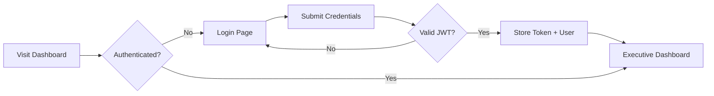
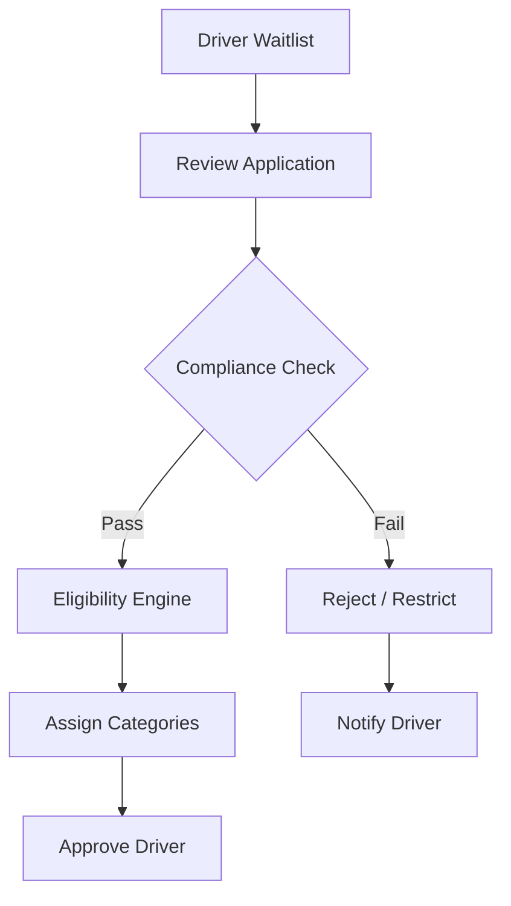
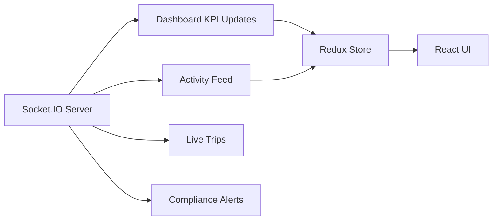

# Alygo Admin Dashboard — Architecture

## 1. Information Architecture

```
Alygo Platform
├── Driver App (mobile)
├── Passenger App (mobile)
└── Admin Dashboard (web) ← this project
    ├── Operations
    ├── User Management
    ├── Compliance & Eligibility
    ├── Pricing & Demand
    ├── Reservations & Locations
    ├── Finance
    ├── Analytics & Reports
    └── System Settings
```

## 2. Dashboard Sitemap

| Section | Routes |
|---------|--------|
| **Dashboard** | `/` |
| **Operations** | `/operations/live-trips`, `/operations/active-drivers`, `/operations/active-passengers`, `/operations/ride-monitoring` |
| **Users** | `/drivers`, `/drivers/:id`, `/drivers/waitlist`, `/passengers`, `/passengers/:id` |
| **Compliance** | `/compliance`, `/compliance/background-checks`, `/compliance/documents`, `/compliance/restrictions` |
| **Eligibility** | `/eligibility/rules`, `/eligibility/categories`, `/eligibility/assignments`, `/eligibility/premium-vehicles` |
| **Ride Categories** | `/categories/:category` (standard, comfort, xl, pet, priority, black, black_suv) |
| **Demand Intelligence** | `/demand/trends`, `/demand/forecasting`, `/demand/heat-maps`, `/demand/earnings-forecasts`, `/demand/event-intelligence` |
| **Dynamic Pricing** | `/pricing/surge-zones`, `/pricing/rules`, `/pricing/surge-history` |
| **Reservations** | `/reservations/scheduled`, `/reservations/airport`, `/reservations/events` |
| **Locations** | `/locations/states`, `/locations/cities`, `/locations/airports`, `/locations/zones` |
| **Finance** | `/finance/revenue`, `/finance/payouts`, `/finance/wallets`, `/finance/transactions` |
| **Analytics** | `/analytics/drivers`, `/analytics/passengers`, `/analytics/revenue`, `/analytics/demand`, `/analytics/compliance` |
| **Settings** | `/settings/platform`, `/settings/notifications`, `/settings/integrations`, `/settings/admin-roles` |
| **Auth** | `/login` |

## 3. User Flow Diagrams

### Admin Login Flow



### Driver Approval Flow



### Real-Time Operations Flow



## 4. Page Hierarchy

```
DashboardLayout
├── Header (search, notifications, user menu)
├── Sidebar (RBAC-filtered navigation)
└── Page Content
    ├── PageShell (title, description, actions)
    ├── KPI Cards / Charts
    ├── Data Tables / Forms
    └── Widgets (activity feed, health monitor)
```

## 5. Component Architecture

```
components/
├── common/          ErrorBoundary, PageShell, PageLoader, StatusBadge, TableFilters
├── layout/          Sidebar, Header
├── dashboard/       KpiCard, ActivityFeed, PlatformHealthMonitor
└── charts/          AnalyticsCharts (Recharts wrappers)

features/
└── [domain]/        Page components per business domain
```

**Design patterns:**
- Lazy-loaded routes for code splitting
- RTK Query for server state
- Redux slices for auth & UI state
- Feature-based folder structure
- Reusable PageShell + glass-card styling

## 6. Design System

| Token | Value | Usage |
|-------|-------|-------|
| Primary | `#6366f1` | Actions, accents |
| Accent | `#22d3ee` | Charts, highlights |
| Surface | `#0f1117` | Background |
| Surface Card | `rgba(22,25,34,0.72)` | Glass cards |
| Border | `rgba(255,255,255,0.08)` | Dividers |
| Success | `#10b981` | Positive metrics |
| Warning | `#f59e0b` | Alerts |
| Danger | `#ef4444` | Errors |

**UI Principles:** Dark theme, glassmorphism cards, enterprise SaaS density, responsive grid layouts.

## 7. State Management

```
store/
├── authSlice        JWT user, live activities, live KPI overrides
├── uiSlice          Sidebar collapse, mobile drawer, global search
└── alygoApi (RTK)   Dashboard, drivers, passengers, trips, compliance, etc.
```

## 8. Authentication & RBAC

| Role | Key Permissions |
|------|-----------------|
| Super Admin | Full access |
| Operations Manager | Operations, drivers, passengers, reservations |
| Compliance Manager | Compliance, eligibility, driver view |
| Finance Manager | Finance, analytics |
| Support Agent | Driver/passenger view, limited manage |

Protected routes check JWT; sidebar filters by `hasPermission()`.

## 9. Real-Time (Socket.IO)

Events: `dashboard:kpi-update`, `dashboard:activity`, `trips:update`, `drivers:status`, `notifications:new`

Demo mode simulates updates when backend is unavailable.

## 10. API Layer

- `services/api/client.ts` — Axios instance with JWT interceptors
- `services/api/index.ts` — RTK Query endpoints (mock data for demo)
- Replace `fakeBaseQuery` with `fetchBaseQuery` when backend is ready

## 11. Responsive Layouts

| Breakpoint | Layout |
|------------|--------|
| Mobile (<768px) | Drawer sidebar, stacked KPIs, scrollable tables |
| Tablet (768–1280px) | 2-column grids, collapsible sidebar |
| Desktop (>1280px) | Full sidebar, 3–5 column KPI grid, split panels |

## 12. Empty & Error States

- `EmptyState` component for zero-data tables
- `ErrorBoundary` for runtime React errors
- Ant Design `Alert` for compliance warnings
- 404 page for unknown routes

## 13. Backend Integration Checklist

1. Set `VITE_API_BASE_URL` and `VITE_SOCKET_URL`
2. Replace RTK Query mock endpoints with real API calls
3. Configure `VITE_GOOGLE_MAPS_API_KEY` for maps
4. Connect Stripe webhooks for finance module
5. Wire Checkr/similar for background checks
